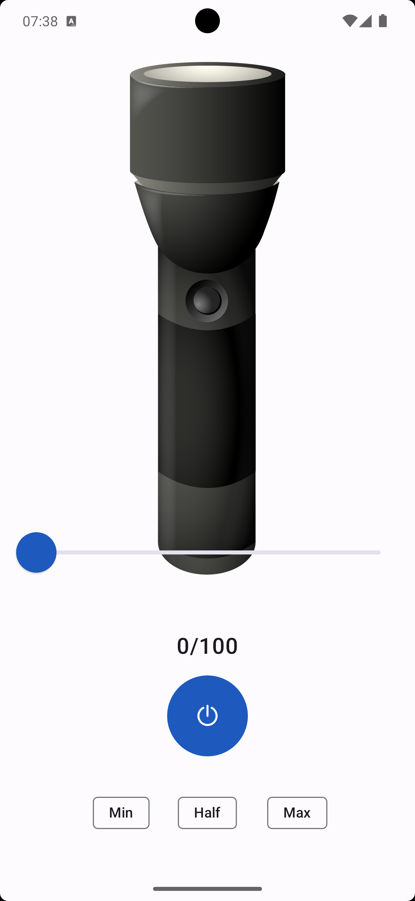

  

# Dimlight
Dimmable flashlight for Android 13+ devices: easily adjust brightness levels of your flashlight

## Screenshots

  
<strong>Home</strong>

  

  
<strong>Language and theme pickers</strong>

  
  

